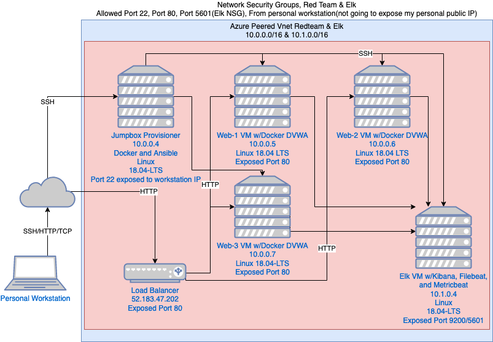

## Automated ELK Stack Deployment

The files in this repository were used to configure the network depicted below.

These files have been tested and used to generate a live ELK deployment on Azure. They can be used to either recreate the entire deployment pictured above. Alternatively, select portions of the playbook files may be used to install only certain pieces of it, such as Filebeat.

This document contains the following details:
- Description of the Topology
- Access Policies
- ELK Configuration
  - Beats in Use
  - Machines Being Monitored
- How to Use the Ansible Build

### Description of the Topology

The main purpose of this network is to expose a load-balanced and monitored instance of DVWA, the DAMN Vulnerable Web Application (Oh boy is it Vulnerable).

Load balancing ensures that the application will be highly available, in addition to restricting access to the network.

Integrating an ELK server allows users to easily monitor the vulnerable VMs for changes to the system services and system logs.

The configuration details of each machine may be found below.

| Name     | Function   | IP Address | Operating System |
|----------|------------|------------|------------------|
| Jump Box | Gateway    | 10.0.0.4   | Linux            |
| Web-1    | Web Server | 10.0.0.5   | Linux            |
| Web-2    | Web Server | 10.0.0.6   | Linux            |
| Web-3    | Web Server | 10.0.0.7   | Linux            |
| Elk      | Monitoring | 10.1.0.4   | Linux            |

### Access Policies

The machines on the internal network are not exposed to the public Internet. 

Only the Jumpbox machine can accept connections from the Internet. Access to this machine is only allowed from the following IP addresses: My personal public IP (will not reveal due to potential security issues of hosting on Github)

Machines within the network can only be accessed by the Jumpox 10.0.0.4

A summary of the access policies in place can be found in the table below.

| Name          | Publicly Accessible | Allowed IP Addresses |
|---------------|---------------------|----------------------|
| Jump Box      | Yes                 | Personal IP Address  |
| Web-1         | No                  | 10.0.0.4             |
| Web-2         | No                  | 10.0.0.4             |
| Web-3         | No                  | 10.0.0.4             |
| Elk           | No                  | 10.0.0.4             |
| Load Balancer | Yes                 | Personal IP Address  |

### Elk Configuration

Ansible was used to automate configuration of the ELK machine. No configuration was performed manually, which is advantageous because it allows for mass configuration of multiple machines with the exact same configurations. Saving on time and removing the possibility of errors.

The playbook implements the following tasks:
- Install Docker
- Download image
- install image
- start docker elk instance with mapped ports

The following screenshot displays the result of running `docker ps` after successfully configuring the ELK instance.

### Target Machines & Beats
This ELK server is configured to monitor the following machines: Web-1 10.0.0.5, Web-2 10.0.0.6, Web-3 10.0.0.7.

We have installed the following Beats on these machines: Filebeat and Metricbeat

These Beats allow us to collect the following information from each machine: Filebeat allows us to collect information about system logs. Metricbeat collects system metrics about services in use such as CPU Usage, RAM Usage, etc...

### Using the Playbook
In order to use the playbook, you will need to have an Ansible control node already configured. Assuming you have such a control node provisioned: 

SSH into the control node and follow the steps below:
- Copy the configuration file to the control node (Ansible).
- Update the playbook file to include the host machines that will be configured.
- Run the playbook, and navigate to [ELKVMIP]:5601/app/kibana to check that the installation worked as expected.

